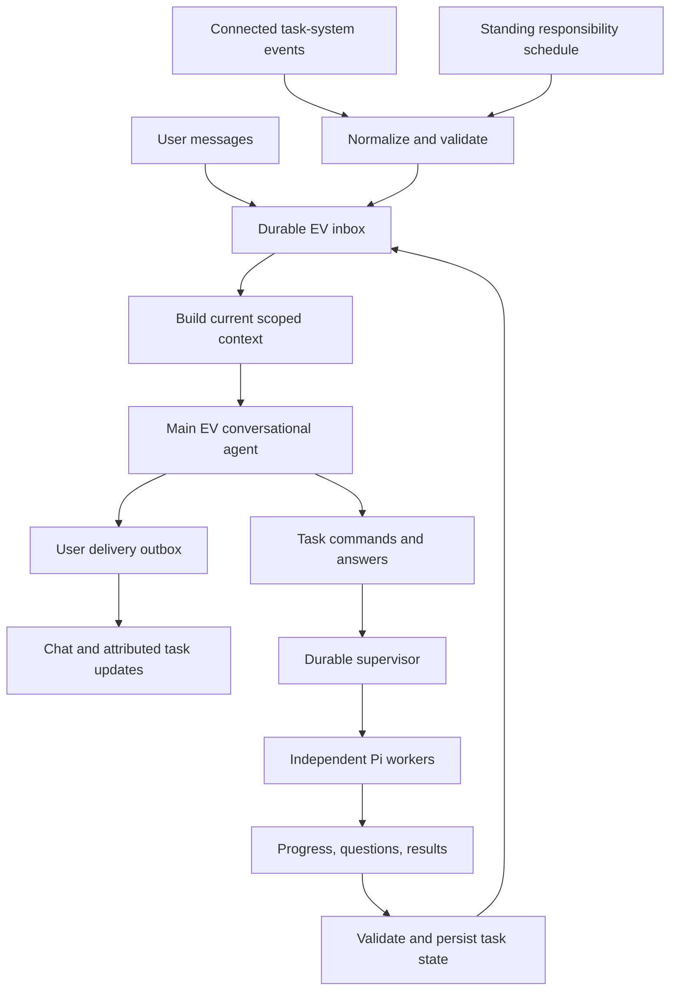

# EV communication flow — review and proposed contracts

Date: 2026-09-21 · Status: amended design review; proposed additions, not implemented behavior

## 1. Finding

The intended experience is one continuing assistant that understands the user, delegates independent work, receives developments, and keeps the conversation coherent. The current plan supports much of the execution infrastructure, but does not yet specify that conversational loop completely.

The largest ambiguity is in [system specification §4](SYSTEM_SPEC.md#4-nonblocking-message-path): incoming messages invoke the coordinator, while outgoing results become a “result job” that produces an EV message. That could be implemented as a separate notification formatter without the main assistant considering the user's latest conversation. The return path should explicitly wake the same logical EV assistant.

“Same assistant” means shared identity, personal understanding, commitments, and resumable conversational state. It does not require one indefinitely running model call or an ever-growing prompt. Pi supplies model/tool execution; EV must supply the durable communication protocol around it.

The user's ChatGPT comparison is an interaction reference. This review makes no claim about ChatGPT's internal implementation.

## 2. What already matches, and what remains unspecified

| Requirement | Existing coverage | Review |
| --- | --- | --- |
| Profile and personality guide EV | [Personal model §8](PERSONAL_MODEL.md#8-runtime-representation-and-authority), system context manifest | Aligned; specify how these combine with resumable conversation state on every wake. |
| Successive messages do not wait for task completion | System §4, product message behavior | Aligned. Durable acceptance and actual model response latency must remain distinct. |
| Independent agents do independent work | System §§5–6: supervisor, separate Pi sessions, task-specific context | Aligned; make the delegation packet concrete. |
| Main EV interprets worker updates before speaking | Structured events, result job, notification outbox | Ambiguous. Explicitly route meaningful worker events through the conversational agent. |
| Workers pause for information and receive the answer | `waiting_input`, generic commands/checkpoints | State exists; question identity, answer routing, delivery acknowledgment, and resumption protocol are missing. |
| EV keeps the user informed | Product §10: material changes, blockers, completion | Aligned in principle; define milestone updates, long-silence handling, batching, and conversation-aware timing. |
| Context is loaded from durable state | Bounded context package and memory manifest | Partial. Pending questions, conversational commitments, unseen worker events, and presentation state are not defined. |
| Other task systems communicate with EV | Connector/capability gateway | Execution access exists in the design; external task synchronization and conflict ownership remain unspecified. |

## 3. Proposed communication loop



The supervisor owns execution mechanics: scheduling, leases, concurrency, retries, checks, and delivery acknowledgments. EV owns the interpretation of the user's intent, assistance strategy, delegation, and conversational presentation. A worker owns execution of its scoped brief. These responsibilities should not become three competing planners.

A source event or schedule is a wake signal, not a user instruction. Before it creates work, EV resolves the current standing responsibility and records an `AttentionDecision`: `ignore`, `observe_only`, `prepare`, `ask`, `notify`, or `defer/digest`. The record includes trigger/source revisions, relevant task/person/relationship revisions, materiality/freshness assessment, budget impact, selected disposition, and any resulting task/message IDs.

For V1, use one logical EV decision runner per owner, with a scope-bound conversation view for each turn. Serialize changes to its conversation/attention state and do not run simultaneous turns against the same Pi session. Independent workers continue in parallel. This is a proposed simplification for the single-owner product, not a requirement for future multi-user architecture.

## 4. Distinguish three durable mailboxes

These can use the existing SQLite jobs/events/outbox machinery. They do not require three new infrastructure products.

| Mailbox | Carries | Completion means |
| --- | --- | --- |
| EV inbox | User messages, meaningful worker reports, input requests, results, connected-system changes | An EV turn durably records its interpretation and intended responses/commands. |
| Task command mailbox | Start, revise, answer, pause, cancel, resume | The targeted run reports applied, rejected, superseded, or an explicit uncertain outcome. Acceptance alone is insufficient. |
| User delivery outbox | EV messages, task-card changes, questions, notification references | A stable delivery is persisted for replay; client delivery/read state is tracked separately. |

Persist new state and downstream mailbox entries atomically. Retry with stable IDs. In particular, an EV crash after proposing a task must not create a second task when the inbox event is retried.

Standing-responsibility triggers use the provider event ID or poll cursor plus responsibility/mandate version as their logical key. Replaying a webhook, reconciliation page, or timer cannot create another logical observation, attention decision, task, or notification. Provider echo events caused by EV's own writes carry origin/action IDs and are reconciled without self-triggering loops.

The queue does not construct intelligence or memory. It schedules a wake; a context builder assembles the current view; EV interprets it; validated commands and messages are committed.

## 5. EV needs both personal context and active conversational state

Profile plus personality is the foundation. It cannot by itself tell EV what it promised five minutes ago, which worker asked a question, or whether that question was already answered.

Each turn should assemble:

1. **Foundation:** EV's charter, allowed person-model projection, relationship/working-style view, and relevant explicit user overrides.
2. **Conversation:** a resumable summary, recent relevant exchanges, current topic, references, and unresolved conversational commitments.
3. **Work and attention:** relevant task briefs and latest verified states, pending questions, outstanding commands, and developments not yet addressed.
4. **Trigger:** the new user message or a bounded batch of worker/external events, with their IDs and source versions.
5. **Supporting evidence and capabilities:** scoped recall, artifacts, available operations, and current permission constraints.

Persist a `ConversationCheckpoint` with source-message references, open commitments, pending question IDs, inbox processing cursors/event IDs, and presentation records. Distinguish events EV has processed, information committed to a user message, and information the user has actually viewed. Summaries are derived views; authoritative task/question state must remain separately queryable.

Load fresh task and model revisions when waking or resuming; do not freeze the profile forever at session creation. Do not load every transcript or every task into every turn. Workers receive task-relevant guidance, such as a creative preference, without the full personal history behind it.

EV's personal-learning `understanding_gaps` and a worker's blocking `InputRequest` are different objects. Curiosity about the user should not accidentally pause a task.

## 6. Make delegation and worker reporting explicit

The existing `ScopedRunBrief` name needs a concrete contract before implementation:

- Stable task/run/parent/request IDs and current brief revision.
- Objective, relevant user instructions, constraints, success criteria, and expected deliverables.
- Project state, selected evidence/artifact references, and relevant person/working-style guidance.
- Granted capabilities, environment, resource/cost limits, dependencies, and cancellation epoch.
- Assumptions the worker may make, conditions requiring escalation, and useful reporting milestones.

Workers should emit typed reports with stable event ID, task/run/brief revision, per-run sequence, occurrence time, phase, meaningful change, evidence references, next step, and any blocker or input request. Worker assessments and verified facts must be distinguishable. A worker cannot declare authoritative completion merely by sending a confident summary.

Persist detailed execution telemetry for inspection, but wake EV for useful milestones, questions, failures, material changes, and verified results. Coalesce replaceable progress reports; never silently discard a pending question or terminal result. Reject stale run ownership and reconcile old brief revisions before they become user-facing claims.

Workers communicate through reports and task commands rather than directly writing as EV in the main chat. EV can inspect a report's evidence when needed. Report content is evidence, not authority to change permissions or the assistant's instructions.

## 7. Input requests need a complete round trip

Introduce a durable `InputRequest` with:

- `requestId`, task/run IDs, brief revision, checkpoint reference, and blocking step or branch.
- Question, why it is needed, requested answer fields, suggested choices, and any genuinely allowed default.
- Relevant evidence, destination conversation, creation time, and optional expiry.
- State, source answer message(s), answer revision, delivery command ID, and application receipt.

Suggested lifecycle:

```text
open -> answered -> answer_queued -> answer_applied -> closed
  \         \            \
   +---------+------------+-> superseded / cancelled / expired
```

“Surfaced to user” is a presentation record, not a prerequisite for answering: EV may already have an explicit, current answer in the allowed context. It should supply that answer with its source rather than repeatedly ask the user. An answer such as “choose for me” can grant discretion within the existing task scope; EV should record the resulting decision.

The round trip is:

1. Worker checkpoints at a recoverable boundary and requests input. Supervisor records the request and blocks the affected work. Independent tasks or branches continue; the paused worker should not occupy a scarce execution slot indefinitely.
2. EV receives the request through its inbox. It either supplies a supported answer or asks the user in the main conversation, naming the task and retaining a hidden request reference.
3. The user replies naturally. EV matches explicit reply/question references first, then task and conversation context. Several pending questions must not collapse into “answer the latest worker.” If the target is ambiguous, clarify while other work continues.
4. EV validates the answer fields. A single message may answer multiple questions and create new work; unresolved fields remain open.
5. Persist the answer and an idempotent `answer_input` command bound to the request and current task revision. Recheck cancellation, supersession, and permission state.
6. Supervisor delivers the answer to the retained task session/checkpoint and records that it was applied. The task becomes runnable; execution resumes when capacity is available. Say “resumed” only when it actually resumes.

No model call needs to remain open while waiting for a human. Restarting the daemon or opening a new conversation must not lose the request or apply the same answer twice. A changed brief may invalidate the question; cancel/supersede it rather than asking the user to answer an obsolete decision.

Ordinary task information and permission decisions are distinct. EV can interpret conversational answers, but new authority still comes from the trusted permission flow already specified. An inferred preference or worker suggestion cannot authorize an external action.

## 8. Presentation, responsiveness, and races

EV's decision for a report should be one of: speak now, ask, update the task card, merge with a relevant response, or defer until a suitable moment/digest. Keep the report IDs and verified state used for that decision. Acknowledging an inbox event is not proof that the user was informed.

Apply the same attention contract to proactive wakes. Each standing responsibility defines material-change criteria, required freshness, quiet hours, immediate-interruption conditions, digest destination, maximum messages/runs/spend, expiry, and review time. Person/relationship guidance may choose an allowed presentation—for example concise versus detailed—but cannot add watched sources, raise budgets, or authorize actions.

The default experience should include useful progress: for example, “The script is ready; I'm assembling the storyboard.” Routine tool calls stay in details. For unusually long work, a configurable check-in can report the last verified phase and any uncertainty; a heartbeat alone must not be described as progress. This extends the current material-change policy without filling the chat with empty activity.

Reserve capacity for user input and task control. Prioritize cancellation, answers that unblock work, and urgent decisions over routine progress, while preserving causal command order and preventing starvation. Do not interpret an ordinary new message as cancellation of an existing task or answer.

Keep main-agent turns bounded and checkpointable; substantial independent research/execution can be delegated. The main EV agent still needs enough reasoning to understand the user, plan, resolve ambiguity, and decide how to help. It should not be reduced to a classifier plus a personality-styled notifier.

Before committing a response or command, recheck the task/question revisions and relevant newer user instructions used by the decision. If a worker reports a 30-second reel after the user changed it to 20 seconds, EV must not present that artifact as the current requested completion. Reinterpret only affected decisions; unrelated incoming conversation should not endlessly invalidate a useful update.

One task keeps a canonical notification destination. The user may answer an open question from another authorized conversation; update the same request, and mark the original question resolved. Do not duplicate full updates across every chat or reveal private-task details in a conversation with narrower scope.

If the coordinator provider is unavailable, messages remain durably received and worker events remain queued. Structured task status and pending decisions should still be visible in Work. The UI must distinguish that fallback from a new conversational response by EV.

## 9. Other task-management systems

If this means EV's internal supervisor, sections 3–8 define the boundary: EV sends commands; supervisor returns acknowledged state and validated events. The UI and main agent consume the same task truth.

If it also means Notion or another external tracker, add an adapter with:

- Stable mapping between EV task ID and provider object ID, account/scope, provider version, and sync cursor.
- Authenticated event ingestion, provider-event deduplication, and polling reconciliation where webhooks are absent or incomplete.
- Explicit field ownership: external project facts can inform a brief; EV run state comes from the supervisor. A tracker checkbox is not evidence that EV's worker completed successfully.
- A rule for external edits: accepted brief changes create a new task revision and a steering event; conflicting edits need reconciliation rather than silent last-write-wins.
- Origin/action IDs to suppress echoes when EV's own write returns as an external event.
- Scoped read/write grants and an explicit policy for archival/deletion. Archiving a tracker card must not silently cancel active execution unless that mapping was configured.

External changes enter the same normalized inbox. They are source data, not automatically instructions to execute arbitrary new work. General two-way tracker synchronization can follow the core V1 communication loop; one connector need only implement the operations its first workflow requires.

## 10. Change the first release gates

This communication loop belongs in V1. Rich inferred personal understanding and the full autonomous computer can remain later releases.

Extend the [first vertical slice](BUILD_PLAN.md#3-first-vertical-slice) with:

1. User requests a task update and a reel in successive messages; both are accepted while work continues.
2. Reel worker reports a milestone; EV presents it in context without blocking the next message.
3. Reel worker asks a necessary creative question and pauses; an unrelated task continues.
4. User replies with an answer and a new independent request in one message; EV routes both correctly.
5. Two workers have open questions; an ambiguous “yes” does not resume the wrong one.
6. Restart while a question is open, then answer from another allowed conversation; resume once from the correct checkpoint.
7. Cancel or revise the task while its question is pending; late reports and answers cannot revive obsolete work.
8. Replay a worker event and an answer command; produce one logical question, answer application, and completion delivery.
9. User changes the brief while EV prepares an update; the posted result reflects the current revision or explicitly labels the old artifact.
10. Coordinator outage leaves received messages, factual status, and pending decisions recoverable; recovery does not duplicate tasks or user messages.
11. A real connected-source event wakes a standing responsibility once, produces one attention decision, and either prepares useful work or records why no action was taken.
12. Source staleness, quiet hours, interruption budget, expiry, pause, and revocation each suppress or defer work exactly as configured.
13. An event caused by EV's own connector write is recognized as an echo and cannot create an unbounded action loop.
14. Every proactive message can answer which responsibility, change, evidence, and threshold caused it to surface now.

Amend system §4 to define both inbound paths, §3 with inbox/question/conversation-checkpoint records, §6 with report and answer delivery contracts, and §12 with corresponding API/events. Add the ordinary question/reply/resume journey to the product spec. Expand EV-01/02/05/06/07 in the build plan rather than leaving this as a later notification feature.

The existing specs have not been silently rewritten by this review. These are the proposed corrections to make the user's intended conversation loop unambiguous before implementation.
