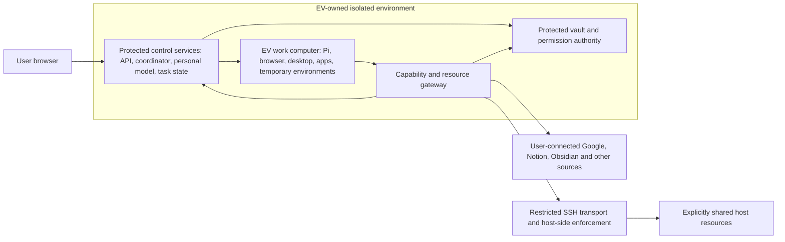

# EV's own computer — future environment and access design

Date: 2026-09-21 · Status: architectural target; full computer autonomy is explicitly beyond V1

## 1. Ownership model

**EV lives in its own isolated environment. The user's computer and connected services are external resources that the user selectively grants it access to.**

The browser on the user's device is a client. EV's conversations, personal model, task manager, files, workers, and application environment persist on the EV side. EV can eventually have its own browser and desktop, edit videos, install applications for a job, manage resources, and clean up after itself.

The EV environment may run locally in virtualization or on an always-on remote machine. Where it is hosted is a deployment choice; the ownership/access boundary stays the same. A local machine sleeping stops locally hosted EV execution. A remote EV can continue while the user's device is offline, except for work that requires that device.

## 2. Architectural layout



“EV's own computer” is the product's environment as a whole. Internally it needs a protected control boundary and a work computer on which the agent can have broad operating freedom. A task sandbox can live within the work computer for reproducibility and cleanup.

**Full administrative access to a guest OS includes access to ordinary files and processes in that OS.** Placing vault files in another directory or ordinary container in the same root-controlled guest does not protect them from that administrator. For the later broad-admin design, keep the key holder, permission enforcement, durable task truth, and recovery controls outside that guest's administrative reach, such as in a separate control VM or the trusted virtualization management layer. They remain part of the EV appliance, not general access to the user's personal machine.

V1 can use a simpler isolated appliance with unprivileged workers and fixed software. Before granting guest administrator capabilities, establish the stronger control/work separation. The exact VM/container/GPU stack remains a later engineering decision, not a promise that a rootless container gives every property of a separate computer.

If the selected first standing responsibility cannot be completed through a typed API connector, V1 may add one narrow authenticated-browser capability before the broad work-computer release. The browser process, credentials, session material, policy authority, and takeover control remain outside the Pi worker's unrestricted reach. This is a bounded adapter for the chosen workflow, not early general desktop control.

## 3. What EV can manage autonomously later

Within a user-granted environment/resource budget, EV should be able to:

- Inspect its installed applications, storage, available compute, running jobs, and tool health.
- Choose a suitable application or CLI for a task and provision a versioned environment.
- Install approved software, resolve dependencies, and launch GUI applications or background jobs.
- Use its own browser and virtual desktop, with observable progress and user takeover.
- Create temporary workspaces, cache reusable assets, and schedule compute-intensive jobs.
- Remove applications/environments it installed temporarily when they are no longer needed.
- Preserve final outputs and reusable procedures while discarding regenerable scratch data.
- Recover a broken work environment from a checkpoint or recreate it, without losing the personal model and durable task history.

An approved source/package policy, disk/CPU/GPU limits, and spending budget can authorize routine lifecycle actions without asking at every install or cleanup. A new license, paid service, resource increase, external account access, or destructive action outside that grant follows its own decision flow.

Control-plane updates, permission changes, vault administration, and removal of the owner's recovery access are not ordinary work-computer maintenance. EV may prepare an upgrade, but a trusted updater applies it under a separately granted policy with rollback.

## 4. Resource lifecycle

Use a persistent environment inventory rather than asking the model to remember which packages it installed.

```text
task need -> inspect inventory -> reuse or provision -> lease resources
  -> install/check -> execute -> verify output -> preserve/export
  -> release lease -> retain reusable environment or remove temporary environment
```

Environment records include application/version/source, installation receipt, owner task, dependency relationships, users of the environment, storage footprint, resource limits, output locations, cleanup class, last use, and recovery state.

Prefer task images, package environments, or snapshots to modifying the base OS for every job. The agent still controls a real computer; reproducible environments make its maintenance reliable. Concurrent jobs hold leases so cleanup cannot remove an application, cache, or file another task still needs.

Separate these storage classes:

| Class | Handling |
| --- | --- |
| Identity, personal understanding, task/permission records | Durable protected state; not a candidate for ordinary disk cleanup |
| User-owned input and final artifacts | Retain/export under the user's policy; clean up only within a specific grant |
| Reusable tools and caches | Evict under budget after checking dependencies and reconstruction cost |
| Task scratch and temporary installed environments | Remove after verification and release of all leases |
| Session/browser authentication state | Managed by the credential/browser boundary, not general cache cleanup |

Checkpoints span durable run state and environment state. Recreating a VM does not undo an email sent or a file published externally. Reconcile outstanding effects before replaying work.

## 5. Limited access to the user's host through SSH

The long-term host bridge uses SSH as authenticated transport, with a dedicated identity and host-side enforcement. SSH encryption alone does not make an account or shell narrowly scoped.

Default host access is absent. The user can connect a particular host and grant resource/operation combinations, for example:

- Read selected reference files from one directory.
- Write exported videos into a dedicated output directory.
- Read an Obsidian vault or a selected folder within it.
- Apply changes in one repository/worktree.
- Execute a small allowlist of host-side jobs under an isolated account.

The host-side endpoint must enforce filesystem/process boundaries regardless of the request text. Use dedicated OS identities, ACLs, a restricted transfer service or command broker, and appropriately isolated processes. A forced command must validate typed requests and resolved paths, including symlinks and command arguments. An unrestricted shell running as the user's normal account is not the restricted bridge.

OpenSSH supports per-key restrictions and forced commands; these are available building blocks, not a complete filesystem/application policy. Disable unnecessary PTY, agent, X11, and port forwarding; do not permit forwarding to circumvent destination restrictions. Verify the chosen configuration on the actual host OS. [OpenSSH server reference](https://man.openbsd.org/sshd).

Pin host identity. The vault/broker holds the SSH private key; ordinary workers request a scoped operation. The private key is not copied into the work guest or forwarded as a general SSH agent. Credential possession and a user grant are both required. Revocation denies future operations and terminates tracked active bridge jobs where possible; report any effects that already occurred.

If the host is offline, waiting work becomes visibly blocked or uses already authorized local copies. The assistant can continue independent work in its own computer. It does not silently fall back to a broader account or public tunnel.

## 6. Plugins and permission levels

Google, Notion, and other network services are connections on the EV side. Obsidian can be an explicitly shared host directory, a synchronized selected copy, or an approved plugin/API bridge depending on the user's setup. Do not assume a cloud API or copy the entire vault by default.

Access is a matrix of scope and operation. User-facing presets make that manageable:

| Preset | Typical authority | Example |
| --- | --- | --- |
| Disconnected | None | EV knows an integration exists but has no account data |
| Observe | Read selected resources | Search approved Notion pages or read a chosen Obsidian folder |
| Prepare | Observe plus work on EV-owned copies/drafts | Draft a document or edit copied footage |
| Act within scope | Named external writes/actions under bounded grants | Save exports in one host folder; update a selected page |
| Manage EV's computer | Application/resource lifecycle inside EV's work guest | Install a render tool and remove its temporary environment |

These presets are not a cumulative ladder to unrestricted access. Managing EV's computer grants no access to Gmail or the host; reading Gmail grants no host execution. Grants specify connection, data resources, operation, purpose/task or reusable scope, duration, use/spend/resource limits, and revocation behavior. An individual action can require more specific authorization than its preset.

Connected content reaches the personal model only under the source's learning/scope policy. Granting EV permission to read a document for one task need not mean storing a permanent global interpretation of its author or the user.

## 7. Browser and desktop semantics

EV's browser belongs to its work environment. User-browser tabs and the host desktop are not implicitly available. Dedicated authenticated browser sessions follow the credential broker and takeover design in the system specification.

A general desktop lane can control EV-owned applications and files broadly. An authenticated lane needs additional protection for credential entry, session stores, and external effects. If later work grants guest root, the authenticated browser and its session material cannot be assumed hidden merely because a broker masks fields; place that browser/session process outside the guest's administrative reach or explicitly downgrade the secret-isolation claim.

The initial narrow lane exposes only the verbs the first workflow needs. It excludes raw CDP, arbitrary page JavaScript, cookie/local-storage/profile reads, unrestricted downloads/uploads, and unbounded navigation. Every operation is tied to a task, current mandate/grant, browser profile, destination, and fencing token. Test prompt injection in text, images and downloads; redirects and DNS changes; screenshot/clipboard/file exfiltration; sensitive forms; takeover races; revocation during navigation; stale workers; and replayed submissions.

The user can watch the work desktop and take control. Automation pauses while the user controls that surface and resumes only after handback; record what changed before continuing. GUI actions have job/application context so an unrelated popup or another task cannot silently receive an intended action.

For video work, distinguish a storyboard, editable project, rendered preview, and exported final. Plan for GPU access, codecs, fonts, licensing, large files, checkpointed renders, and resource contention. Do not select a virtualization/GPU solution before the later compatibility spike.

## 8. Example: install, edit, export, clean up

1. User requests a reel using footage in an approved host folder.
2. EV reads only the selected files through the host bridge and stages them in its work computer.
3. Its personal model supplies relevant creative direction and collaboration preferences; the task brief supplies the required output.
4. The environment manager finds the needed application unavailable and provisions it from an allowed source within the existing resource grant.
5. EV edits and renders through CLI or desktop control, while the supervisor tracks the job.
6. It checks the output, preserves the editable project as requested, and exports to the approved host folder or connected destination.
7. It releases resource leases and removes the temporary environment, retaining reusable information according to policy.
8. It records a verified capability result and tells the user the outcome. A missing host connection can delay export without losing the finished work.

This is a future-release acceptance journey. The first launch-steward milestone may use one narrow browser adapter, but it does not include application installation, video rendering, broad desktop control, or automated cleanup of a general work computer.

## 9. What the first version must anticipate

V1 should use logical environment IDs and resource references, not assume task paths are host paths. Keep connection references separate from credentials, and personal/task state separate from disposable execution directories. Include environment operations behind an interface even if V1 supports only a fixed image.

An initial environment interface should cover inspect, create workspace, run job, observe, stop, collect artifact, checkpoint, and release. A selected V1 workflow may also receive its explicitly registered browser adapter. Later extensions add general browser/desktop sessions, application install/remove, resource resizing, image upgrade, and environment restore. Unsupported methods report unavailable; they do not imply hidden host access.

The future host bridge is a capability adapter, disabled by default. Do not require SSH or a complete desktop to ship V1. Do not design V1 around mounting the user's home directory and later hope to remove that dependency.

## 10. Later research and release gates

Choose the computer architecture through a separate spike: GUI reliability, GPU/video support, browser protection, root-admin isolation, suspension/restore, storage/cost, and remote access all matter. Validate install/use/uninstall without damaging another job or losing outputs.

Required tests include a hostile work guest trying to read control/vault storage, bypass host scope through paths or forwarding, access the hypervisor, increase its quota, erase recovery state, or retain access after revocation. Also test benign failures: interrupted installs, full disks, broken packages, GUI crashes, host disconnect, checkpoint restore, and task cancellation during render/export.

The intended outcome is broad practical autonomy *inside EV's work computer* and explicit, enforceable permissions everywhere it connects.
