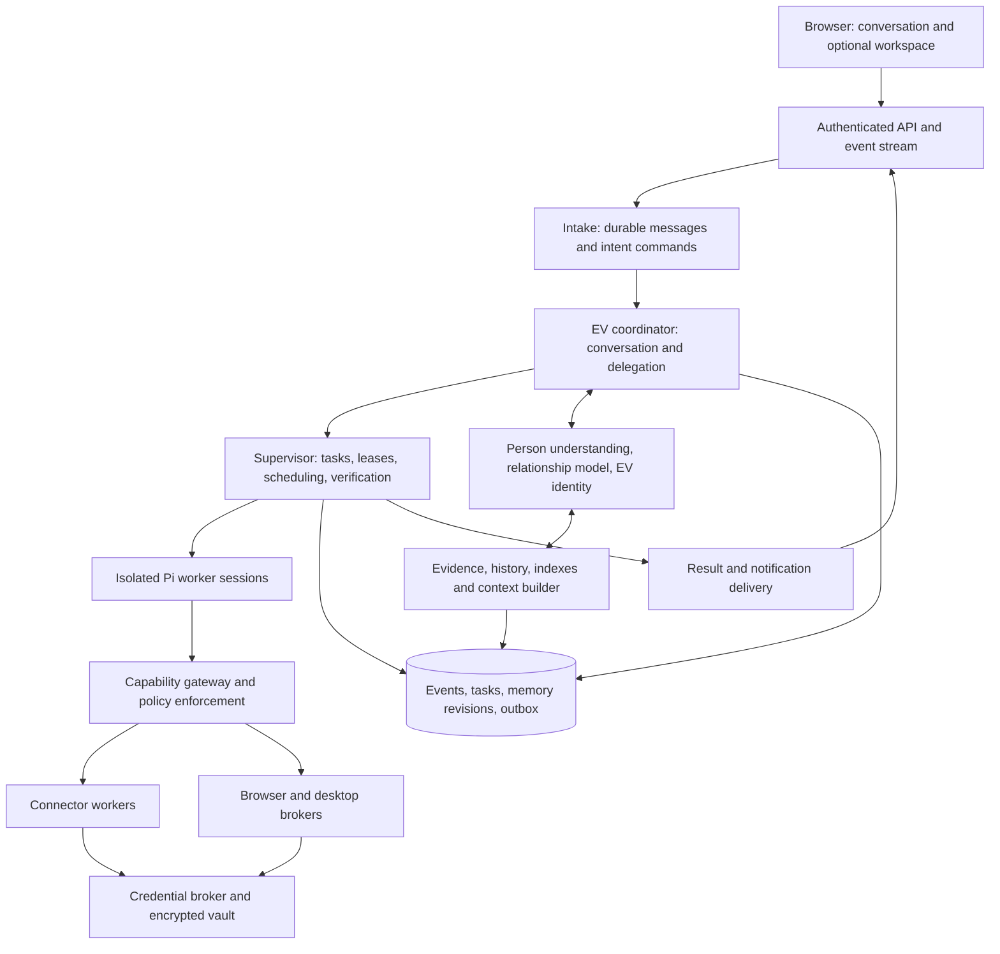

# EV personal assistant — system specification

Date: 2026-09-21 · Status: proposed architecture, not implemented

Revised around [EV's personal understanding](PERSONAL_MODEL.md) and [its own computer](COMPUTER_ENVIRONMENT.md). The personal model determines what EV learns and how it helps; the memory infrastructure supports it. The complete desktop/application environment is a later-release target, with boundaries established in V1.

## 1. Components and responsibility



This is a logical decomposition. EV's API, coordinator, task storage, personal understanding, memory, and execution belong to its isolated environment; the user's browser is a client. Start with one TypeScript control daemon with explicit modules, and separated execution/credential boundaries. The later work guest can have broad administrative access only when protected control services are outside that guest's reach. See the deployment topology in the computer specification. Do not create a fleet of microservices solely to match the diagram.

| Layer | Owns | Cannot decide |
| --- | --- | --- |
| Browser | Messages, rendering, deterministic user controls | Worker permissions or task truth |
| EV coordinator | Interpret the user's situation, select useful assistance, plan, converse, delegate | Secret values or self-granted authority |
| Personal-model service | Person/relationship understanding, EV's learned style, open questions, adaptation outcomes | Assume inferred mental states are certain or override permissions |
| Supervisor | Task state, runs, leases, retries, dependencies, budgets | User identity or inferred permission from a memory |
| Pi harness | Model/tool turns, local execution, session checkpoints | Global scheduling or authoritative external completion |
| Memory service | Evidence-derived claims, versions, recall, consolidation | Tool permissions or task completion |
| Policy/capability gateway | Enforce grant, scope, destination, payload, budget | Change a grant based on untrusted content |
| Credential broker | OAuth refresh, encrypted secrets, scoped credential use | Expose raw secrets to agent context |

EV can use Pi for its coordinator session too. That session has assistant-level tools: person/relationship views and revisions, task queries/commands, scoped memory reads, capability discovery, and artifact references. It can request vault-managed capability use through the gateway; it cannot read raw credentials or open an unrestricted host shell. It operates in short turns; substantive execution goes to other Pi sessions.

## 2. Runtime assumptions and initial stack

- Single owner; Node/TypeScript control daemon in an isolated EV environment; authenticated browser/PWA client. The environment can be hosted locally or remotely.
- React with TypeScript and a small client router is the proposed new interface; use Vite for the application shell. Existing vanilla-JS workstation can remain separately runnable during migration.
- SQLite with WAL and migrations for the first single-host durable store. All writes go through the daemon. Pi and plugins cannot open the database file.
- Relational tables for tasks/events/memory/typed edges, full-text indexing, and an optional embedding index. Start with bounded graph traversal in the relational store. A dedicated graph engine must earn its operational cost in evaluation.
- Content-addressed artifact files with metadata and access checks; encrypted backup and deletion inventory.
- HTTPS and authenticated sessions before remote browser access. No hosting-provider selection is implied; this is not a short-lived serverless job architecture.
- V1 target: isolated appliance with fixed software and scoped Pi execution. The development prototype may run alongside it, but product logic must not depend on the personal host's filesystem or session. Later, add a persistent work computer with desktop/apps and resource management. Local sleep and remote-host availability remain explicit constraints.
- Treat the user's host as an optional external connection from the start. The future SSH bridge uses dedicated credentials and host-side resource/operation enforcement; it is disabled until explicitly connected and granted access.

These are implementation recommendations, not claims that SQLite or a particular frontend solves memory or orchestration. Multi-host workers may later justify Postgres and a dedicated queue behind the same contracts.

## 3. Identities and durable objects

Keep these identities distinct:

```text
owner
  conversation -> message -> intent
  project -> task -> task_revision -> run_attempt -> Pi session
                         |                 |
                         +-> artifacts     +-> checkpoints / tool receipts
  source episode -> memory claim revision -> derived summary / typed edge
  owner -> person_model_revision / relationship_revision / EV_identity_revision
  shared experience -> adaptation_episode -> revised understanding / assistance
  standing responsibility -> trigger/source cursor -> attention decision -> task/action
  EV environment -> work computer -> resource lease / application / job
  connection -> scoped grant -> proposed action -> execution receipt
```

A conversation can reference many tasks. A task can span conversations. A retry creates a new run attempt under the same task. A task may have several child tasks and each child may have its own session. Renaming a project never changes its ID.

Minimum persistence model:

| Table/group | Required fields and constraints |
| --- | --- |
| `conversations`, `messages` | Owner, scope, role, content ref, server sequence, client idempotency key, reply/task references, timestamps |
| `intents` | Source message, kind, target task(s), routing evidence refs, expected task version, status |
| `projects` | Brief/version, canonical name, aliases, allowed data scopes, workspace roots |
| `tasks`, `task_revisions` | Objective, success criteria, project, parent, priority, state, version, notification destination, budget, cancellation epoch |
| `dependencies` | Task/step prerequisites; reject cycles |
| `runs`, `checkpoints` | Attempt, adapter/version, sandbox/session ref, input/context manifest, lease, fencing token, heartbeat, current step, next action, result |
| `commands` | Stable ID, target/version, accepted/delivered/applied/rejected state, payload ref |
| `events` | Monotonic sequence, stable event ID, owner/scope, entity/version, type, redacted payload ref, causal IDs |
| `jobs`, `outbox` | Unique logical job/delivery key, due time, attempts, lease, backoff, delivery status |
| `responsibilities`, `triggers`, `attention_decisions` | Watched resource, mandate/version, schedule/event cursor, freshness/materiality rule, preparation/action boundary, interruption/run/spend budget, expiry/review, reporting destination, selected disposition and evidence |
| `artifacts`, `receipts` | Content hash/version, task, location, MIME, provenance, verification, external object/action ID |
| `connections`, `grants`, `actions` | Account reference, operation/resource constraints, payload digest, expiry, use limit, grant revocation version |
| `person_models`, `relationship_models`, `ev_identity` | Scoped current views, revision IDs, explicit overrides, evidence links, temporal qualifiers; V1 can begin with explicit inputs |
| `understanding_gaps`, `adaptation_episodes` | Useful uncertainty, alternatives, interpretation, selected assistance, expected/observed outcome; richer inference is a later feature |
| `environments`, `resource_leases` | Logical environment/workspace IDs now; later application inventory, resource quotas, cleanup/restore and task dependencies |
| `memory_*` | Evidence, entities, claims, revisions, edges, indexes, context manifests, retention/deletion state; see memory spec |

Task state and its event/outbox record change in one transaction. Unique constraints prevent duplicate intent handling, worker leases, and notifications. Redacted event metadata remains append-only during ordinary operation; deletable personal content lives in controlled payload storage. “Append-only” must not make privacy deletion impossible.

## 4. Nonblocking message path

1. `POST /v1/messages` validates identity, scope, size, attachments, and idempotency key. It commits the message and intake job atomically, then returns `202` with message ID and event cursor.
2. A small intake worker resolves explicit references first and invokes the coordinator with a bounded context package. It emits one or more typed intents. The gateway validates every proposed command.
3. Status queries use task projections immediately. If freshness is insufficient, return the last verified state plus a refresh job. Do not wait on an unrelated worker to ask a question.
4. New work commits the brief, success criteria, allowed scopes, budget, task event, and dispatch job in one transaction.
5. The scheduler leases runnable work. A task-specific Pi session starts or resumes inside its assigned sandbox.
6. Structured worker events update run state; validated receipts update task state. A result job produces a concise EV message with artifact references.
7. The outbox delivers the message and optional notification. The browser subscribes through SSE with a resumable cursor.

Schedules and connected-source events enter through the same durable intake boundary. A normalized trigger references a standing-responsibility version, provider event/cursor, source revision, and deduplication key. It is not automatically a command to act. EV first loads the current mandate, task/person/relationship revisions, source freshness, pending work, and attention budget; then it records one of `ignore`, `observe_only`, `prepare`, `ask`, `notify`, or `defer/digest`. Any task or message produced from that decision carries the decision and trigger IDs.

The source adapter owns provider reconciliation and echo suppression. The supervisor owns work state. The companion owns whether a verified development deserves the user's attention. Personality can shape wording and timing inside an allowed range; it cannot broaden what is watched or authorized.

Intake order is assigned per owner/conversation; execution is independent. A coordinator actor processes short routing turns in order, reserving capacity for new input. Independent long answers become background reasoning tasks so the actor is not monopolized. If a coordinator call exceeds its time budget, checkpoint/defer it and process the next intake item. Never concurrently mutate one Pi session from multiple turns.

“Also make it shorter” arriving before the preceding task ID has been returned uses the prior message's intent mapping. Explicit reply/task references outrank inferred recency. Ambiguous control commands wait for clarification; independent requests continue.

Writes based on stale task versions fail a compare-and-swap check and re-read the latest brief. Each output records the brief version it satisfies. An artifact prepared before a steering revision remains an earlier version, never the current completion result.

## 5. Task lifecycle and concurrency

```text
accepted -> queued -> running -> verifying -> completed
                    |   |          |
                    |   +-> waiting_input / waiting_permission / waiting_dependency
                    |   +-> retry_wait / paused / failed
                    +------ cancel_requested -> cancelled
```

Waiting states resume into queued after the blocking condition changes. Verification failure may requeue a bounded repair attempt or fail with evidence. Completed tasks are reopened only through an explicit new revision/continuation, preserving the completed artifact and receipt.

The supervisor enforces transitions. A model saying “done” is a completion proposal. Completion needs a final result, required artifacts, and objective-specific checks. A read-only research task may require sources and an answer; a rendered reel requires a playable file with expected duration/dimensions; a publication requires a provider receipt and destination check.

Concurrency defaults are configurable and conservative: begin with two execution workers plus reserved intake capacity. Rate limits, CPU/GPU slots, per-provider budgets, and account-level quotas constrain admission. The system queues excess work rather than silently dropping it or recursively spawning.

Tasks may spawn bounded children through `tasks.spawnChild`. The supervisor validates scope, deadline, depth, cost, and whether the work is independent. Child access is no broader than the parent grant. Parent completion requires all necessary child outputs to be verified or explicitly marked omitted/partial.

Resource locks cover shared working copies, documents, browser profiles, and external destinations. Use a separate worktree for concurrent repository edits. Use conditional writes/ETags where providers support them. Browser sessions have one active controller; parallel browsing uses independent profiles/contexts with an explicit authentication policy.

The scheduler uses priority plus aging to avoid starvation. Background memory work is lower priority than interactive intake and active task control. Budgets are charged at each run/tool boundary, including retries, child runs, and memory/provider calls.

Standing responsibilities have their own lifecycle: `draft -> active -> paused -> expired/revoked`, with a review time and maximum unattended period. Only an active current version can admit a trigger. Changing the watched source, external destination, write authority, spend, or sensitive data class creates a new mandate version and may require a new trusted decision. Revocation prevents new leases/actions immediately and reconciles active work; it cannot undo a completed external effect.

## 6. Pi integration

On this machine, `pi --version` returned **0.84.4**. Installed docs verify RPC support for prompt, steering, follow-up, abort, queue clearing, and state inspection. Pi's README explicitly leaves subagents, MCP support, and permission prompts to integrations/extensions. [Current README](https://github.com/earendil-works/pi/blob/main/packages/coding-agent/README.md), [RPC contract](https://github.com/earendil-works/pi/blob/main/packages/coding-agent/docs/rpc.md).

**Initial choice: isolated subprocess RPC.** Run one Pi process per active session within the execution boundary; retain session files in a scoped persistent volume. Prefer RPC here because it separates process lifecycle and versions from EV. The SDK is an alternative for a future worker process, not a reason to run arbitrary tools in the web/API process. [SDK documentation](https://github.com/earendil-works/pi/blob/main/packages/coding-agent/docs/sdk.md).

Pin package versions and hashes, including extensions. The first spike confirms provider compatibility and the exact installed event schema; do not infer support solely from current online docs.

### Adapter contract

```ts
interface WorkerAdapter {
  start(brief: ScopedRunBrief): Promise<RunHandle>;
  events(run: RunHandle, after?: string): AsyncIterable<RunEvent>;
  steer(run: RunHandle, command: SteeringCommand): Promise<DeliveryReceipt>;
  pause(run: RunHandle): Promise<CheckpointOrUncertainState>;
  cancel(run: RunHandle, epoch: number): Promise<StopReceipt>;
  inspect(run: RunHandle): Promise<RuntimeObservation>;
  resume(checkpoint: CheckpointRef): Promise<RunHandle>;
}
```

This is EV's proposed interface. It is not a claim that Pi exposes all these methods natively. The adapter implements pause/checkpoint/recovery using the documented lifecycle plus sandbox process control.

Map `prompt` to accepted work, `steer` to a revision delivered at a safe turn boundary, and `follow_up` to work that should wait until a session is idle. A follow-up in one session is not parallel execution. Use separate sessions for independent tasks. RPC command acceptance is not task completion.

For cancellation: first persist a new cancellation epoch and revoke further task action leases; then clear queued messages, abort the current Pi operation, and reconcile tool outcomes. If necessary terminate the sandbox process tree after a grace period. `abort` alone does not imply all queued work or external effects are cancelled. Long-running tools need their own job handles and cancellation controls.

Checkpoint at meaningful boundaries: session path/version, brief version, task step, completed receipts, pending action IDs, artifact references, current context manifest, next action, and required permissions. Pi conversation compaction and EV long-term memory remain independent mechanisms.

The coordinator tool surface is small. Workers receive task-specific tools via approved extensions. Remote MCP servers, when used, sit behind EV's connector gateway; tool discovery does not bypass grants. Unreviewed Pi packages must not execute in the daemon or credential broker.

## 7. Recovery and external effects

Lease work with a heartbeat and fencing token. If a lease expires, a newer run can take ownership, but old workers cannot commit state or obtain new action authorization using an obsolete token.

On restart, reconcile unfinished runs against the sandbox/process and pending action registry. Resume from retained sessions only after resolving whether the last side effect occurred. Record restart/retry events; do not fabricate uninterrupted progress.

Queue delivery is at-least-once. Aim for exactly-once *logical* action where an external system supports an idempotency key. Do not promise exactly-once external effects universally.

For each effect:

1. Persist an action intent and digest.
2. Authorize against current task, grant, destination, and payload.
3. Use a provider idempotency key/conditional revision when available.
4. Save returned operation ID and verify the observable result.
5. On timeout, check the external state before retrying. If the outcome cannot be established, enter `waiting_input`/an explicit uncertain-effect state and explain the ambiguity.

Cancelling a task prevents future actions but cannot unsend an email or guarantee stopping an already submitted render. Receipts distinguish stopped, completed before cancellation, and uncertain.

## 8. Sandbox and network boundary

All action-capable Pi workers execute in sandboxes. A host subprocess or tmux session is not the security boundary.

The ownership boundary encloses EV as a product, not only worker subprocesses. Durable personal/task state and control services live on the EV side, and user-host access is an optional connection. Inside that environment, isolate disposable work from protected state. This supports the later self-managed work computer without requiring unrestricted host access in V1.

The initial sandbox spike evaluates rootless containers with user namespaces, dropped capabilities, syscall restrictions, read-only base image, bounded storage/resources, and only task directories mounted. Do not mount the host home, SSH directory, shared cloud credentials, Docker socket, or EV database. More adversarial workloads or hosted multi-user deployment require a stronger VM/microVM boundary selected and tested separately.

Network is deny-by-default. Workers reach approved model/tool brokers through a controlled network path, with raw outbound sockets blocked by OS/network policy. Check resolved destination IPs and redirects; prevent private-network/metadata access and DNS rebinding. A proxy environment variable alone does not enforce this.

Model calls also send data outside the sandbox. The context builder and model gateway must enforce owner/provider/data-class policy and record which permitted provider received which scope. Tool restrictions do not make inference local or zero-retention. Choose provider policies during setup and verify them before sensitive use.

Browser sessions and desktop automation later run on EV's own work computer. Its resource/application management can operate autonomously within grants. The user's host is accessed through a limited SSH capability bridge with enforced account, path, command, and forwarding restrictions. The full computer design, including safe guest administrator access, is specified in [computer environment](COMPUTER_ENVIRONMENT.md).

## 9. Vault, connectors, and approvals

Muse's published architecture places credential custody and permission enforcement outside the execution cell and brokers authenticated browser access. The design principle EV adopts is that agent-generated requests are checked by an independent authority. Replicating all of Muse's custom kernel tracking or claiming equivalent security is outside this plan. [Source](https://research.meta.ai/blog/security-and-safety-for-ai-agents-our-approach-with-muse).

EV's credential broker uses an established OS key store or maintained secret-management component, not custom cryptography. Encryption keys are held separately from encrypted data. The first release supports encrypted storage, restrictive access, secure setup, token refresh, revocation, redacted logs, and a documented backup/unlock flow.

“EV has access to the vault” means it can discover permitted connections and request credential-backed operations. Raw values remain with the trusted broker. For the later guest-admin release, this broker and its keys must be outside the work guest's administrative reach. Permission presets are Disconnected, Observe, Prepare, Act within scope, and Manage EV's computer; these apply per resource and do not form a ladder to universal access. See the [permission matrix](COMPUTER_ENVIRONMENT.md#6-plugins-and-permission-levels).

Connector flow:

```text
Pi -> typed action + connection reference
   -> gateway checks policy and exact action
   -> isolated connector worker obtains narrowly scoped credential use
   -> provider API
   -> sanitized result + receipt -> Pi / supervisor
```

Prefer this typed broker to giving arbitrary CLIs real tokens. If a provider requires credential injection, constrain it to a verified destination/method and a dedicated worker. Generic surrogate-token rewriting is a later compatibility project, not a universal v1 promise.

A connector manifest records ID/version/hash, publisher, supported operations, input/output schema, credential references, egress destinations, side-effect category, data scopes, sandbox profile, idempotency behavior, and test fixtures. Install, connect, grant, and invoke are separate lifecycle steps. Upgrades that change permissions require a visible review of the change.

Policy is deterministic for known rules, with model assistance only for classification/advice. Grant bindings include owner, task or broader authorized scope, connection/account, operation, allowed resource/destination, payload digest or explicit constraints, expiry, maximum uses/spend, and revocation version. Revalidate at execution time. Schema validation and policy checks are server-side.

A standing responsibility is not itself a secret or raw credential, but it is the user-readable root for recurring authority. Its mandate binds watched resources, permissible observations, prepared outputs, allowed reversible effects, approval-required effects, source freshness, purpose, budget, reporting, expiry, and revocation version. Every action authorization identifies the task/run, responsibility/mandate version when present, concrete operation, destination/resource, payload digest or constraints, and source/context revisions. “The user likes initiative” and “the user asked EV to keep an eye on this” are not sufficient authorization records.

Approval cards are rendered from trusted action records. The authenticated user's response goes directly to the policy service. Agent text cannot forge approval or suppress a required card. A changed payload requires renewed authorization unless the existing grant explicitly permits that change. Previously authorized actions within scope proceed without another prompt.

Connecting email does not imply authority to use password-reset links or authentication codes. Sensitive authentication content should be excluded from ordinary connector results. Treat filtering as a tested defense, not a perfect guarantee.

## 10. Browser and computer use

This section is a later-release design, not a V1 delivery requirement. EV's own desktop, broad application lifecycle, video editing, resource management, and limited host SSH are detailed in [computer environment](COMPUTER_ENVIRONMENT.md). V1 provides compatible environment/capability interfaces with a fixed tool image.

The browser broker owns the authenticated browser process and session state. Workers receive typed navigation, snapshot, click, fill, download, and task-scoped upload operations. Arbitrary page JavaScript/CDP access is excluded from the authenticated lane. A separate uncredentialed developer/browser and general desktop lane may have broader control over EV-owned applications. When the agent has guest root, the protected authenticated lane must sit outside that guest's administrative reach; field masking alone is insufficient.

V1 may admit one narrow authenticated-browser workflow earlier than the general desktop release when the selected standing responsibility cannot be completed through a typed connector. It still uses the protected broker, exact destination/operation grants, takeover pause, action receipts, and denial of raw session material. This exception does not grant a general browser, arbitrary page scripting, or broad desktop authority to Pi.

Secure sign-in is a user takeover flow. Pause agent observation and actions during credential entry; mask sensitive fields in subsequent snapshots. The agent must not read cookies, local storage, browser profiles, or vault files. Logout/disconnect invalidates relevant sessions and grants.

Control flow is not the only leakage path: screenshots, downloads, clipboard data, form bodies, URL queries, and browser network traffic need explicit data-handling rules. Sensitive form submission requires a concrete reviewed action or an existing scoped grant. Do not claim that hiding password input alone eliminates exfiltration.

For Blender, use an isolated process with a dedicated scene/work directory, versioned input assets, output receipt, resource limit, and cancellable render job. Interactive use, if needed, goes through the desktop broker. A Blender plugin is a capability integration, not access to the entire personal desktop.

## 11. Memory interface and context contracts

The first-class person/relationship service maintains the current understanding of the user, EV's collaboration style, and useful open questions. It uses the memory service for evidence and revisions. It influences planning, attention, learning priorities, and response form. Its learning loop and separate evaluation are defined in [personal model](PERSONAL_MODEL.md).

Memory reads are authorized before retrieval, not filtered after private content has entered a prompt. Workers only see a context package prepared for their task. The coordinator can request broader allowed context, but cannot override scope policy.

```ts
type ContextManifest = {
  ownerId: string; taskId?: string; conversationId: string;
  responsibilityId?: string; mandateRevision?: number; triggerId?: string;
  taskRevision?: number; memoryRevision: number; eraseEpoch: number;
  personRevision: number; relationshipRevision: number; evIdentityRevision: number;
  sourceIds: string[]; claimRevisionIds: string[];
  excludedScopes: string[]; tokenBudget: number; builtAt: string;
};
```

Proposed operations: `memory.observe`, `memory.propose`, `memory.recall`, `memory.explain`, `memory.correct`, `memory.consolidate`, `memory.archive`, and `memory.erase`. Workers may propose memories with sources; only the memory service validates and commits them. Access policy and confirmed user corrections are higher priority than learned summaries.

Above them, provide `person.readView`, `person.proposeRevision`, `person.correct`, `relationship.readPolicy`, `relationship.proposeAdaptation`, and `adaptation.recordOutcome`. V1 uses explicit goals/preferences and simple collaboration instructions; later releases enable evaluated contextual inference and personality adaptation. Resetting learned style is separate from deleting factual memory, and both obey the source/derivation deletion rules where applicable.

## 12. API and event outline

| API | Semantics |
| --- | --- |
| `POST /v1/messages` | Persist and accept input, never await task completion |
| `GET /v1/events?after=...` | Scoped resumable SSE; retention gap returns resync instruction |
| `GET /v1/tasks/:id` | Authoritative projection, version, freshness, artifact refs |
| `POST /v1/tasks/:id/commands` | Steering, priority, pause/resume/cancel with expected version |
| `GET /v1/responsibilities/:id` | Current mandate, source/trigger state, budgets, expiry, recent decisions and runs |
| `POST /v1/responsibilities` | Create a draft mandate; activation requires a trusted user decision for its scopes |
| `POST /v1/responsibilities/:id/commands` | Activate, revise, pause, resume, revoke or test with expected mandate version |
| `GET /v1/artifacts/:id` | Authorized metadata/download or isolated preview |
| `POST /v1/actions/:id/decision` | Authenticated grant/rejection against bound payload |
| `POST /v1/connections/:provider/start` | Trusted OAuth/credential setup, state/PKCE where supported |
| `DELETE /v1/connections/:id` | Revoke future use and initiate provider revocation |
| `GET /v1/memory/:id` | Claim, revisions, scope, evidence and derivation links |
| `POST /v1/memory/commands` | Correction, scoped stop-use, pin, or deletion job |

Events include `message.accepted`, `intent.resolved`, `responsibility.created`, `responsibility.revised`, `trigger.observed`, `attention.decided`, `task.created`, `task.state_changed`, `run.started`, `run.checkpointed`, `command.delivered`, `command.applied`, `action.proposed`, `action.receipted`, `artifact.verified`, `memory.revised`, `notification.ready`, and `deletion.completed`.

Authenticate HTTP and event streams. Enforce CSRF protection for cookie-authenticated writes, origin checks, upload limits, artifact MIME handling, and per-owner authorization. Existing host-shell/tmux endpoints cannot remain reachable as an accidental bypass in the new public service.

## 13. Observability and acceptance

Measure input acknowledgment latency, queue delay, first meaningful reply, worker start time, useful completion rate, duplicate effects, recovery rate, steering latency, permission denials, task cost, and notification usefulness. Also measure full cost/time to verified outcome: every coordinator, worker, retrieval, compaction, memory, review/classifier, retry and provider call; context/tool-schema size; unnecessary questions; user corrections; unwanted interruptions; and important changes missed by attention policy. Memory has separate quality/cost metrics.

Initial targets to validate, not measured results: p95 durable acceptance under 300ms on a local healthy host; p95 status response under two seconds excluding provider outages; reconnect replay without duplicate deliveries; zero uncontrolled worker egress in the security test suite.

Required fault tests: kill daemon after an action request but before receipt; kill worker mid-tool; replay a message; expire a lease; revoke a grant during work; deliver steering during verification; reconnect after event retention; inject instructions through a document; erase memory during consolidation; exhaust a budget; lose provider response after a write.

No release claim of a secure autonomous assistant follows from passing only unit tests. See the staged live, sandbox, connector, and browser gates in [build plan](BUILD_PLAN.md).
