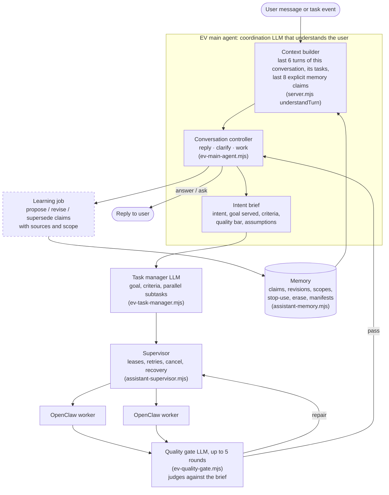

# EV manual QA: does it actually get the person?

This checks the one thing EV exists for: **understanding a person who is unpredictable, contradicts himself, changes his mind and changes as a person, without drifting or collapsing into confusion.** There are two tools:

- **Scenarios** (`npm run qa`): 40 short scripted timelines, from mild to extreme. Each one targets a specific failure: venting read as a decision, a temporary rule that never expires, a quote attributed to the wrong person, and so on. They play against the real EV and produce a scorecard that a person grades.
- **Evolution arcs** (`npm run qa:arc`): a model plays the person through a written life timeline over simulated weeks, sending hundreds of natural messages. After each phase EV is probed, and a judge model scores EV's memory and answers against that phase's ground truth. The result is a drift curve over time, not a pile of scorecards.

Neither is a unit test. Nothing asserts EV's wording.

## The map

What a user message is supposed to pass through, and which scenarios exercise each part. Dashed boxes don't exist in the code yet (as of `main` @ `0568960`, after PR #5 added EV's main agent).



| Part | Exists? | Scenarios that test it |
| --- | --- | --- |
| Conversation controller (reply, clarify or work) | Yes, since PR #5. It needs `OPENCODE_API`; without it every message falls back to a task | L1-*, L4-05, L5-*, L6-02, L7-01/05/06 |
| Context builder | Partly: recent turns and tasks *in this conversation only*, plus the last 8 explicit claims. Nothing from earlier conversations unless typed into the memory panel | L1-02/03, L2-01, L6-04, L7-02 |
| Intent brief (assumptions, one round of questions) | Yes | L1-04/05, L4-07, L6-05 |
| Follow-ups that change running work | No: a new message can't steer or cancel a running task | L6-01, L6-03, L7-01 |
| Learning from conversation (propose, supersede, scope, expiry) | No: memory changes only through the panel | L2-*, L3-*, L4-01/03/04/06, L5-*, L7-03/04/05 |
| Memory store (revisions, scope, stop-use, erase) | Yes | L2-02/03/04, L3-05, L7-06 |
| Task manager, supervisor, OpenClaw | Yes | L6-* |
| Quality gate | Yes, with a review loop against the brief. It still passes results through when the reviewer is unavailable | L6-05, L6-06 |
| Authority boundary | Partly (no posting connectors exist) | L6-07, L7-03 |

## The ladder: mild to extreme

| Level | What passing proves | Scenarios |
| --- | --- | --- |
| **L1 Reflexes** | EV tells talk from work, answers questions about its own output, resolves "it" and "the second one" | 5 |
| **L2 Memory carries over** | Things said in chat shape later conversations; corrections replace; forget really forgets | 5 |
| **L3 Scope and time** | Preferences stay inside their project and expire when they should; moods aren't traits | 5 |
| **L4 Conflict without confusion** | Oscillation, venting, quoting others, sarcasm, misremembering and stated-vs-revealed preference all end in one coherent current picture | 7 |
| **L5 Goals and identity evolve** | Dropped goals become history and can be revived; skill growth and life pivots change what EV prioritises | 5 |
| **L6 Tasks under a fickle user** | Running work follows the latest intent, never duplicates, keeps good work, and is reviewed against the person | 7 |
| **L7 Extreme** | Whiplash, memory flooding, poisoned content, an 8-week life arc, sustained contradiction and gaslighting, and understanding still converges | 6 |

The persona is the same everywhere: an indie builder who works a backend job, builds a habit app called Tidepool, makes a YouTube devlog, does a bakery client's website, and drifts toward music. Each scenario still starts from a person EV has never met. The runner gives every scenario its own empty EV data directory.

### What "working as intended" means across all levels

When grading, look for these properties, not just the individual boxes:

1. **Current vs history.** At any moment EV can say what is true *now*, and separately what used to be true and when it changed. Superseded beliefs are kept as history, never silently deleted or left active.
2. **Statement vs decision vs mood.** "I hate React Native" while debugging is not "switch frameworks". "Thinking of an EP" is not "making an EP".
3. **Scope.** A rule said about one project, period or context stays there unless the user generalises it.
4. **Calibration.** Inferences are marked as inferences, with evidence, and lose to anything the user says explicitly.
5. **Convergence, not drift.** The L7-04 "who am I" probe, asked every session, should get *more* accurate as the arc goes on. Old facts shouldn't creep back, and the summary shouldn't flatten into a generic person.
6. **Honest disagreement.** When the user misremembers, EV cites its record politely, and updates only on a real change of mind.
7. **One voice, one task per intent.** Questions, status checks and tweaks don't spawn duplicate work; cancelling one thing never touches another.

## Running it

```bash
npm run qa -- --list                       # all scenarios
npm run qa -- --scenario L4-01             # one scenario, all sessions back to back
npm run qa -- --level 2                    # one level
npm run qa                                 # everything
```

Each scenario gets its own EV server on a free port with `EV_DATA_DIR` pointing at `data/qa-runs/<run>/<scenario>/ev-data`, so memory starts empty and your real EV data is untouched. Results go to `data/qa-runs/<run>/<scenario>/scorecard.md` (grade here) and `result.json`. `data/qa-runs/<run>/summary.md` collects the auto-checks across scenarios.

Real runs need what the product needs: `openclaw` on `PATH` and `OPENCODE_API` set (in `.env` is fine). Without the key, EV's main agent can't read messages and falls back to starting a task for every one, and every task fails with `OPENCODE_KEY_MISSING`. That only tests the plumbing.

### Time between sessions

Every session runs on a fresh EV process whose clock is shifted to the session's simulated `day` (default: one day per session). The shift comes from a QA-only preload, `qa/lib/shift-clock.mjs`, and the product code doesn't know about it. "Four weeks later", expiry and stop-use windows therefore take seconds, not weeks. All sessions of one scenario share one data directory, so they meet the same EV memory.

To run sessions spread over real time instead, run one at a time under the same run name:

```bash
npm run qa -- --scenario L7-04 --session 1 --run real-1     # this week
npm run qa -- --scenario L7-04 --session 2 --run real-1     # next week, same person
```

To drive a live server you already have open, pass `--base-url http://127.0.0.1:4317`. Its memory is shared with everything else you've done on it and its clock isn't shifted, so only use that for exploratory runs.

### Grading

Open the scorecard. For every user line you see EV's reply, any tasks it started, their final answer, which memory each task was given, and the memory at the end of the session. Tick **Expect** boxes that clearly happened and **Fail** boxes that happened at all. A scenario passes only when every Expect is ticked and no Fail is. The lines marked "Memory after this step" describe what the memory panel should hold. Compare them with the snapshot at the end of the session.

### Adding a scenario

Add an object to the right `qa/scenarios/L*.json` file. A session is `{ "label", "day"?, "steps": [] }`. A step is either `{ "say": "...", "tasks": 0 | 1 | "any", "wait": false?, "expect": [], "fail": [], "memory": "...", "probe": "..." }` or an action: `{ "do": "wait" }`, `{ "do": "memory.remember", "value" }`, `{ "do": "memory.correct" | "memory.stop_use" | "memory.erase", "match": "text in the claim", "value"?, "expiresAt"? }`, or `{ "do": "task.cancel" }` (cancels the latest running task). Every session is a new conversation with the same person.

## Evolution arcs: understanding over many turns

Scripted scenarios top out at a few dozen messages. Real evolution, both the person's and EV's model of the person, needs hundreds of turns spread over time, scored against what is actually true at each point. An arc (`qa/arcs/*.json`) gives the harness:

- **A persona**: how the person writes (short, vague, sarcastic, vents, misremembers, quotes others).
- **Phases on a simulated calendar.** Each phase has the person's situation, how to behave (for example, "vent about React Native first, decide on Flutter later"), and **ground truth** for that point in time:
  - `current`: what is true now;
  - `history`: what used to be true;
  - `undecided`: what is still open;
  - `mustNotBelieve`: false or erased things EV must not hold.
- **Probe questions** asked at the end of every phase in a fresh conversation, such as "who am I and what am I trying to do?", "what are my projects and where does each stand?" and "what have I changed my mind about?".

For each phase, the runner:

1. starts EV with its clock at that phase's day;
2. lets the simulated person hold a few new conversations with EV (default 2 sessions × 8 messages, adjustable), with EV's replies and finished-work messages fed back to the simulator;
3. asks the probes in a fresh conversation and snapshots memory;
4. has a judge model mark every ground-truth item: `correct`, `partial`, `stale`, `missing` or `wrong` for current items; `kept_as_history` or `presented_as_current` for history; `kept_open` or `falsely_settled` for undecided items. The judge also lists violations, contradictions and invented facts.

`drift.md` puts one row per phase into a table, followed by the judge's per-item evidence, the probe answers and memory. **Healthy understanding:** current-truth accuracy rises or holds across phases, stale stays at 0, history is kept, undecided stays open, and violations, contradictions and invented facts stay at 0. Drift shows up as falling accuracy, rising stale counts, or resurrected beliefs (say, a forgotten manager's name or "hates dark mode") in later phases.

The included arc, `sam-12-weeks`, has 8 phases over 75 simulated days. Sam goes from engineer with a side app, to framework flip-flops, to considering an EP, to deciding on it while misremembering a preference, to quitting his job and asking EV to forget a name, to money pressure and monetisation whiplash, to settling on a plan and reversing his short-answers preference.

```bash
npm run qa:arc -- --list
npm run qa:arc                                         # whole arc, about 130 messages + probes
npm run qa:arc -- --run sam-a --phases p1,p2,p3        # part of it; rerun with the same --run to continue
npm run qa:arc -- --messages-per-session 20            # longer phases
```

The simulated person and the judge need a model key: `OPENCODE_API`, or `EV_QA_API_KEY` with optional `EV_QA_MODEL_URL` / `EV_QA_MODEL`. EV needs its own key too. Simulator and judge are separate calls from EV, but by default they use the same model family, so a blind spot shared by all three could hide a failure. Spot-check `drift.md` against the transcripts, and consider pointing `EV_QA_MODEL` at a different model.

**Time and cost (estimates, not measured):** without tasks, a phase is about 16 EV turns plus 4 probes, each needing a model call, so a few minutes. Every message that becomes work adds 30 seconds to several minutes of OpenClaw and review time. The default arc's `workShare` of 25% means around 30 tasks, so a full arc is likely to run for an hour or more.

## Baseline runs, 2026-10-08

Both runs were made in a cloud container without OpenClaw or an OpenCode key. They test the plumbing; they are not a verdict on EV's understanding.

- **`main` @ `318e5cc`, before EV's main agent:** every message started a task, including "hey", "ok fine" and "how's that going?", always with the same canned reply. Memory stayed empty in every scenario except L2-04, which writes through the memory panel.
- **`main` @ `0568960`, after PR #5:** the same result: 8 of 114 task-count checks matched, and those are all steps where a task was expected anyway. Without a key, the main agent can't run and EV falls back to starting a task for every message. EV now also posts its own message when a task settles ("I couldn't finish …"), and the runner records it.
- **What's needed for a real verdict:** run `npm run qa` and `npm run qa:arc` on a machine with `openclaw` and `OPENCODE_API`. The main agent should then fix most L1 checks. L2 and above also need EV to learn memory from conversation, which no code does yet, so expect them to fail until that exists.
