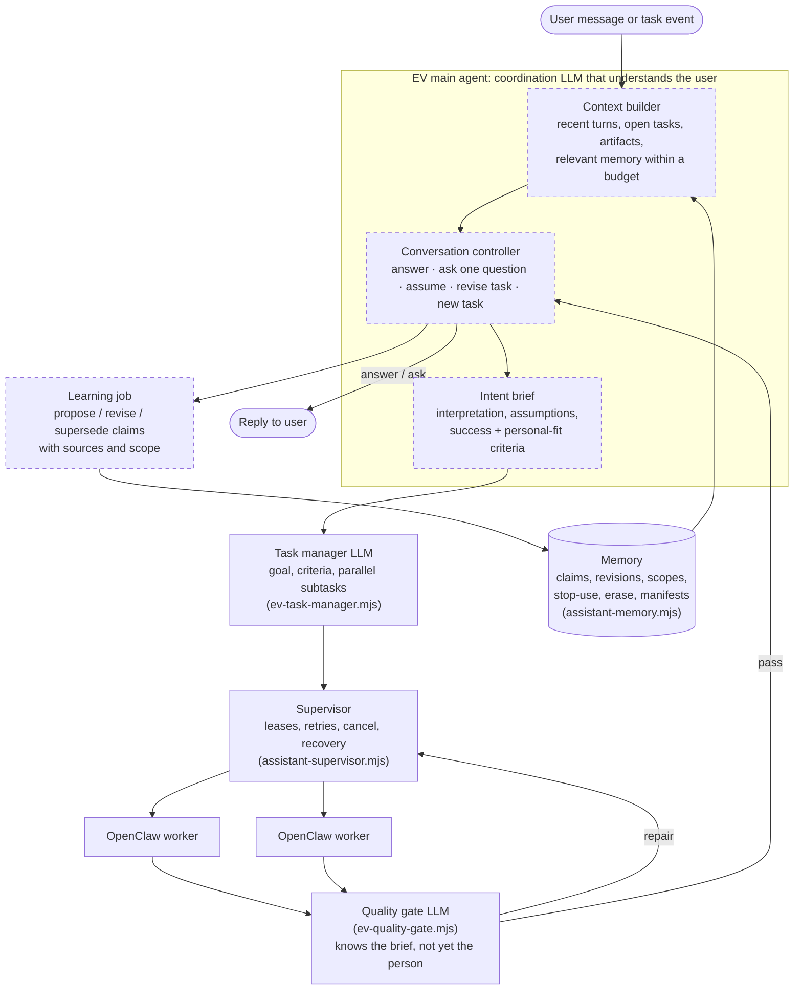

# EV manual QA: does it actually get the person?

These scenarios check the one thing EV exists for: **understanding a person who is unpredictable, contradicts himself, changes his mind and changes as a person, without drifting or collapsing into confusion.** Each scenario is a scripted user timeline. `npm run qa` plays it against the real EV and writes a transcript and a scorecard. A person grades the scorecard.

Nothing here is a unit test. The scripts don't assert EV's wording. They only record what happened, auto-check what is countable (did a task start?), and snapshot memory after every session so drift is visible.

## The map

What a user message is supposed to pass through, and which scenarios exercise each part. Dashed boxes don't exist in the code yet (as of `main` @ `318e5cc`).



| Part | Exists? | Scenarios that test it |
| --- | --- | --- |
| Conversation controller (talk vs work, follow-ups, questions) | No: every message becomes an OpenClaw task | L1-*, L4-05, L5-*, L6-01/02/03, L7-01/05/06 |
| Context builder (history + relevant memory) | No: tasks get the last 8 explicit claims | L1-02/03, L6-04, L7-02 |
| Intent brief (assumptions, one consequential question) | No | L1-04/05, L4-07, L6-05 |
| Learning from conversation (propose, supersede, scope, expiry) | No: memory changes only through the panel | L2-*, L3-*, L4-01/03/04/06, L5-*, L7-03/04/05 |
| Memory store (revisions, scope, stop-use, erase) | Yes | L2-02/03/04, L3-05, L7-06 |
| Task manager, supervisor, OpenClaw | Yes | L6-* |
| Quality gate | Yes, but it knows nothing about the person and fails open | L6-05, L6-06 |
| Authority boundary | Partly (no posting connectors exist) | L6-07, L7-03 |

## The ladder: mild to extreme

| Level | What passing proves | Scenarios |
| --- | --- | --- |
| **L1 Reflexes** | EV tells talk from work, answers questions about its own output, resolves "it" and "the second one" | 5 |
| **L2 Memory carries over** | Things said in chat shape later conversations; corrections replace; forget really forgets | 5 |
| **L3 Scope and time** | Preferences stay inside their project and expire when they should; moods aren't traits | 5 |
| **L4 Conflict without confusion** | Oscillation, venting, quoting others, sarcasm, misremembering and stated-vs-revealed preference all end in one coherent current picture | 7 |
| **L5 Goals and identity evolve** | Dropped goals become history and can be revived; skill growth and life pivots change what EV prioritises | 5 |
| **L6 Tasks under a fickle user** | Running work follows the latest intent, never duplicates, keeps good work, and is reviewed against the person | 7 |
| **L7 Extreme** | Whiplash, memory flooding, poisoned content, an 8-week life arc, sustained contradiction and gaslighting, and understanding still converges | 6 |

The persona is the same everywhere: an indie builder who works a backend job, builds a habit app called Tidepool, makes a YouTube devlog, does a bakery client's website, and drifts toward music. Each scenario still starts from a person EV has never met. The runner gives every scenario its own empty EV data directory.

### What "working as intended" means across all levels

When grading, look for these properties, not just the individual boxes:

1. **Current vs history.** At any moment EV can say what is true *now*, and separately what used to be true and when it changed. Superseded beliefs are kept as history, never silently deleted or left active.
2. **Statement vs decision vs mood.** "I hate React Native" while debugging is not "switch frameworks". "Thinking of an EP" is not "making an EP".
3. **Scope.** A rule said about one project, period or context stays there unless the user generalises it.
4. **Calibration.** Inferences are marked as inferences, with evidence, and lose to anything the user says explicitly.
5. **Convergence, not drift.** The L7-04 "who am I" probe, asked every session, should get *more* accurate as the arc goes on. Old facts shouldn't creep back, and the summary shouldn't flatten into a generic person.
6. **Honest disagreement.** When the user misremembers, EV cites its record politely, and updates only on a real change of mind.
7. **One voice, one task per intent.** Questions, status checks and tweaks don't spawn duplicate work; cancelling one thing never touches another.

## Running it

```bash
npm run qa -- --list                       # all scenarios
npm run qa -- --scenario L4-01             # one scenario, all sessions back to back
npm run qa -- --level 2                    # one level
npm run qa                                 # everything
```

Each scenario gets its own EV server on a free port with `EV_DATA_DIR` pointing at `data/qa-runs/<run>/<scenario>/ev-data`, so memory starts empty and your real EV data is untouched. Results go to `data/qa-runs/<run>/<scenario>/scorecard.md` (grade here) and `result.json`. `data/qa-runs/<run>/summary.md` collects the auto-checks across scenarios.

Real execution needs what the product needs: `openclaw` on `PATH` and `OPENCODE_API` set (in `.env` is fine). Without them every task fails with `OPENCODE_KEY_MISSING`. The conversation and memory checks are still meaningful, but task results can't be judged.

### Longitudinal runs (real time between sessions)

Scenarios with "Week" or "Month" sessions are best run with real gaps, which also exercises expiry:

```bash
npm run qa -- --scenario L7-04 --session 1 --run arc-1     # this week
npm run qa -- --scenario L7-04 --session 2 --run arc-1     # next week, same person
```

The data directory under `--run arc-1` persists, so session 2 meets the same EV memory. The scorecard grows with each session. To use a live server you already have open instead, pass `--base-url http://127.0.0.1:4317`. Its memory is shared with everything else you've done on it, so only use that for exploratory runs.

### Grading

Open the scorecard. For every user line you see EV's reply, any tasks it started, their final answer, which memory each task was given, and the memory at the end of the session. Tick **Expect** boxes that clearly happened and **Fail** boxes that happened at all. A scenario passes only when every Expect is ticked and no Fail is. The lines marked "Memory after this step" describe what the memory panel should hold. Compare them with the snapshot at the end of the session.

### Adding a scenario

Add an object to the right `qa/scenarios/L*.json` file. A step is either `{ "say": "...", "tasks": 0 | 1 | "any", "wait": false?, "expect": [], "fail": [], "memory": "...", "probe": "..." }` or an action: `{ "do": "wait" }`, `{ "do": "memory.remember", "value" }`, `{ "do": "memory.correct" | "memory.stop_use" | "memory.erase", "match": "text in the claim", "value"?, "expiresAt"? }`, `{ "do": "task.cancel" }` (latest running task). Every session is a new conversation with the same person.

## Baseline run, 2026-10-08 (`main` @ `318e5cc`)

All 40 scenarios were run in a cloud container without OpenClaw or an OpenCode key, so task outputs couldn't be judged. What the run did show:

- **Every user message started a task**, including "hey", "ok fine", "how's that going?" and "how many times have I changed my mind?". Every `tasks = 0` auto-check failed, and every reply was the same canned "I'm working on this now…".
- **Memory stayed empty for every scenario except L2-04**, the only one that writes through the memory panel. Nothing said in chat was ever learned.
- So no scenario above L1 can pass until the EV main agent (conversation controller, context builder, learning job) exists. That is the build order in `/mnt/project-files/reviews/ev-inventory-gap-review.md`.
